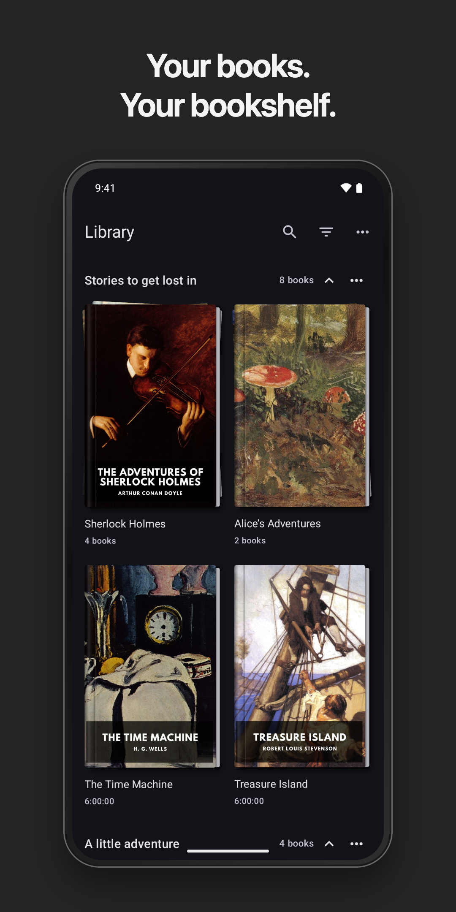
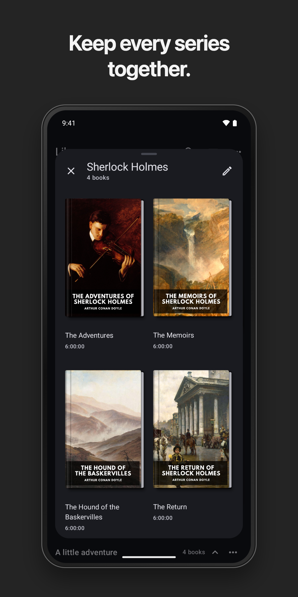
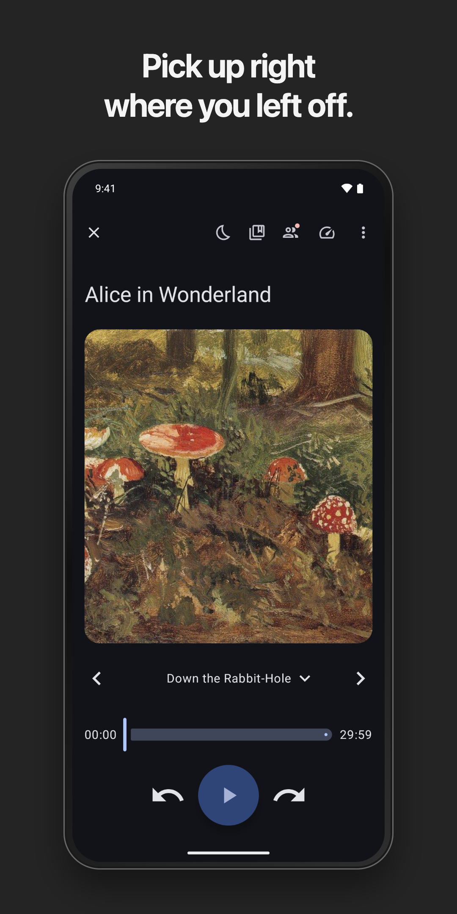
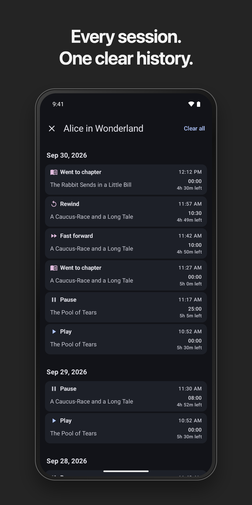
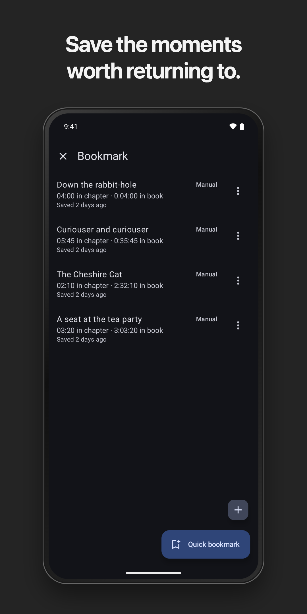
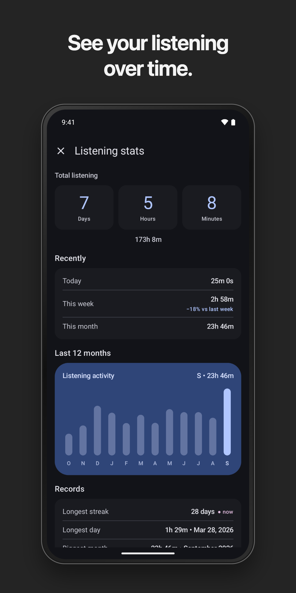
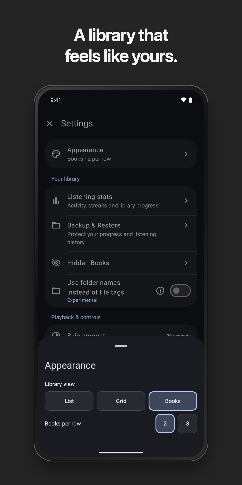
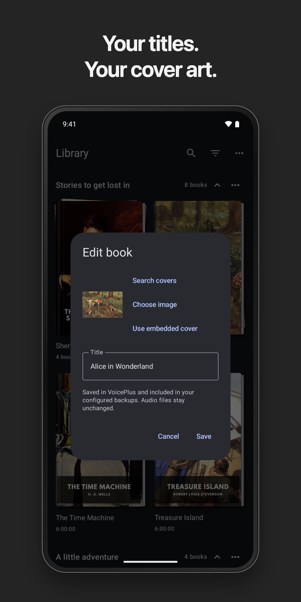
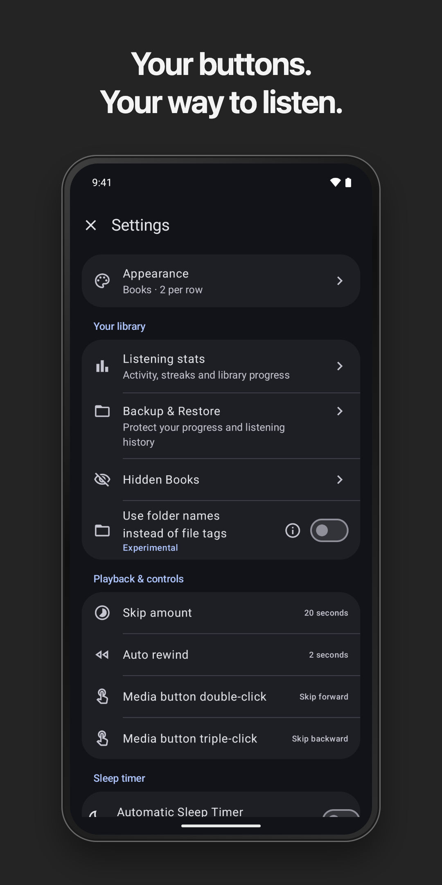

# VoicePlus

[](https://www.gnu.org/licenses/gpl-3.0)
[](https://f-droid.org/packages/com.github.mistermo_vibecode.voiceplus/)
[](https://github.com/Mistermo-vibecode/VoicePlus/releases)
[](https://github.com/Mistermo-vibecode/VoicePlus/actions/workflows/ci.yml)

An open-source audiobook player for Android, with personal shelves, series grouping, listening history and flexible playback controls. No accounts, ads or analytics.

Built on [Voice](https://github.com/PaulWoitaschek/Voice) by Paul Woitaschek and contributors.

## Screenshots

<p align="center">
  <a href="docs/screenshots/phone/library.png"></a>
  <a href="docs/screenshots/phone/series.png"></a>
  <a href="docs/screenshots/phone/playback.png"></a>
</p>
<p align="center">
  <a href="docs/screenshots/phone/listening-log.png"></a>
  <a href="docs/screenshots/phone/bookmarks.png"></a>
  <a href="docs/screenshots/phone/listening-statistics.png"></a>
</p>

### Make it yours

<p align="center">
  <a href="docs/screenshots/phone/appearance.png"></a>
  <a href="docs/screenshots/phone/edit-book.png"></a>
  <a href="docs/screenshots/phone/playback-settings.png"></a>
</p>

---

## What's new in v1.29

- A book-inspired library with cropped portrait covers, subtle page edges, and a choice of two or three books per row
- Personal shelves and series stacks, with editable ordering and drag-to-move between visible shelves; Current keeps your active books within reach
- A focused Appearance editor for Books, Grid and List layouts
- Edit titles and covers without rewriting audio files; edits survive rescans and travel with portable backups
- More reliable chapter-number corrections when navigating backward through irregular chapter markers
- Protection against accidental headphone or media-button resume after the sleep timer finishes
- Optionally remember volume boost across all books
- Updated playback libraries and refreshed phone and tablet screenshots

### Previous additions in v1.28

- Customize the now-playing toolbar with up to four shortcuts; other actions stay in the menu
- Toolbar choices are saved and included in settings backups
- Add a quick bookmark directly from the bookmarks screen, or use the separate named-bookmark button
- Completed books show a completion badge and finish date in the library
- Refreshed dark-mode phone and tablet screenshots

### Previous fixes in v1.27

- Later Chapter Fix corrections preserve earlier chapter names and respect restored names
- Long-press menus work in search results — thanks [@JamesDBartlett3](https://github.com/JamesDBartlett3)
- Android Auto forward/rewind keys keep the correct direction without changing headset preferences — thanks [@geofgowan](https://github.com/geofgowan) for reporting

---

## What's different from Voice

- Listening Log with clear chapter positions and timestamps
- Listening Statistics with trends, records, finished books, and relisten counts
- Character lists for each book
- Smarter sleep timer with interaction reset and chapter countdowns
- Customizable lock-screen progress, secondary text, and playback controls
- Flexible backup and restore — encrypted Android system backup plus automatic and manual saves to a folder you choose
- Editable chapter names and tools to fix out-of-sync numbering
- Hide and restore books from the library
- Resizable widget with configurable opacity and text scale
- Customizable media button actions (double/triple press)
- Personal shelves, ordered series stacks, and a book-inspired library view
- Portable title and cover edits that leave your audio files unchanged
- Firebase removed entirely — no analytics or background telemetry

---

## Download

[](https://f-droid.org/packages/com.github.mistermo_vibecode.voiceplus/)

Or grab and sideload the APK from the [Releases](https://github.com/Mistermo-vibecode/VoicePlus/releases) page.

---

## Build from source

Requires JDK 21 and Android SDK. See [development instructions](docs/development.md) for setup and tests, and `gradle/libs.versions.toml` for exact versions.

```bash
git clone https://github.com/Mistermo-vibecode/VoicePlus.git
cd VoicePlus
./gradlew :app:assembleLibreRelease
```

---

## License

GPL v3 — see [LICENSE.md](LICENSE.md).
Upstream Voice copyright Paul Woitaschek and contributors. VoicePlus modifications copyright Mistermo.
